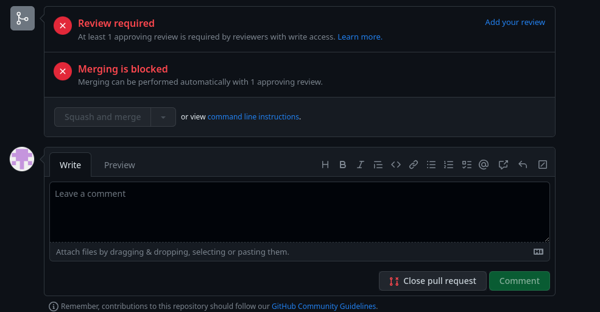

# code-review-pull-request

Este repositório será utilizado para testes de criação de Pull Request durante sua implementação.
A equipe poderá utilizá-lo para testar Pull Requests e tirar dúvidas.

## Criação de Pull Request

Após realizar o push do código para a branch de desenvolvimento, **NÃO** realize mais o merge! Crie um Pull Request.

O Code Review será realizado através do Pull Request.

O merge será feito pelo revisor através do Pull Request, após aprovação do desenvolvimento realizado.

Para criar um Pull Request, siga os passos abaixo (considerando que o dev já realizar o push do código para sua branch): 

1. Entre no repositório pelo navegador.
2. Verifique se abaixo do nome do repositório, existe a seguinte mensagem:

3. Clique no botão "Compare & pull request".
4. Se não houver a mensagem, clique em **Pull requests** no cabeçalho da página e clique no botão **New pull request**
5. Ajuste a branch de destino para a branch na qual irá receber o código. No exemplo abaixo, o código da branch **ajuste_teste** irá para a branch **main**.
    - Verifique se a mensagem **Able to merge** está ao lado com a cor verde. Caso não esteja, significa que seu código possui conflitos, impossibilitando prosseguir. Resolva o conflito, e crie o Pull Request novamente.

6. Altere o nome do pull request para o seguinte padrão: **[PROJETO] TIPO DE DESENVOLVIMENTO: Spec/Card**, por exemplo **[ECOMMERCE] FEATURE: CARD001 - Ajuste de Readme**
7. Se houver, insira o arquivo de Spec na descrição, arrastando para a caixa de descrição ou clicando no texto abaixo da caixa.
8. Ao lado direito, clique em **Reviewers** e insira o time **projetofocvserp/reviewers**.
9. Ainda no meu lateral, clique em **Labels** e insira a label do projeto e do tipo de desenvolvimento, se é feature ou fix.
10. Clique no botão **Create pull request** e aguarde a finalização.
11. Após o code review, caso o revisor aprovar, o dev irá fazer o merge clicando em **Merge pull request**

## Review

Para realizar o review de um pull request siga os passos abaixo:

1. Entre no repositório pelo navegador.
2. Clique em **Pull requests** no cabeçalho da página.
3. Os pull requests pendentes estarão na aba **Open**
4. Após a descrição do ṕull request, existe o botão Add your review, clique nele.

5. Após revisar o código, clique em **Review Changes**, adicione um comentário se necessário, e selecione uma das opções:
    - **Comment**: Apenas adicionar um comentário
    - **Approve**: Aprova o pull request e disponibilza para realizar o merge
    - **Request changes**: Solicita alterações no código, e manteḿ o pull request aberto até que seja corrigido.
        - Também é possível solicitar alterações em linhas específicas ao clicar no simbomo **+** ao lado da linha no código, e adicionar o comentário.     
        
6. Ao aprovar, clique na seta ao lado de **Merge pull request** para selecionar o método de merge:
    - **Create a merge commit**: fazer o merge levando todos os commits para a a branch base.
    - **Squashe and merge**: fazer o merge unificando todos os commits da branch de desenvolvimento em um unico, deixando o histórico mais limpo.
    - **Rebase and merge**: irá recriar a branch base baseada na branch de desenvolvimento.
        - **ATENÇÃO**: O título utilizado ao realizar o merge substitui o comentário do commit, deve ser utilizado de acordo com o *commit pattern*.
7. Após selecionar o método, basta clicar no botão para realizar o merge.